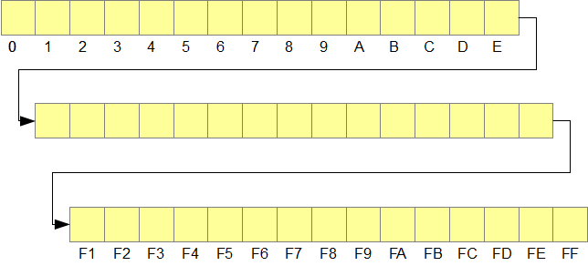

# Pointers, Arrays and Structs

## Learning Outcomes

After reading this section, you will be able to:

* Connect procedures using pass-by-value and pass-by-address semantics to build a complete program
* Design data collections using arrays and structures to manage information efficiently

## Introduction

A distinguishing feature of the C programming language is its direct access to primary memory.  The core language defines a separate pointer type for each primitive type and C compilers accept pointer types for each derived type.  This enables programmers to store the address of any type - primitive or derived - in a pointer variable.  The pointer types corresponding to the primitive types are:

- `char*`
- `int*`
- `float*`
- `double*`

The type of a pointer variable determines the number of bytes to interpret when converting into a data type the bit string in primary memory that starts at the specified address. 

Pointers and arrays are closely related in the C language.  The name of an array holds the address of the start of the array; that is, the name of the array is a pointer.  Since arrays by definition store element data contiguously in memory, we can access any array element using pointer syntax. 

This chapter examines this relationship between pointers, arrays and structures in more detail.  The chapter reviews pointer and array syntax and shows where syntax is interchangeable. 


## Review

We can model RAM as a linear map and use addresses on this map to identify bytes of information stored within memory.  For instance, in 512Mb of RAM, the address 0 identifies the first byte, the address 1 identifies the second byte and address 512Mb-1 identifies the last byte. 



### Pointers

**Syntax**

A pointer is a variable that stores an address.  To allocate memory for a pointer that holds the address of a variable of type `double`, we write:

```c
double *p;
```

We say that `p` ***points*** to a `double`.  We store the address of the `double` in `p` as follows:

```c
double x = 456.7;
double *p = &x;
```

If the address is unknown, we initialize the pointer to `NULL`:

```c
double *p = NULL;
// ...
double x = 456.7;
p = &x;
```

We can access data through a pointer once the pointer contains a valid address.  To access the data at the address pointed to, we ***dereference*** the pointer using the `*` operator:

```c
double *p = NULL;
double x = 456.7;

p = &x;

printf("Value stored in x %.1lf", *p); 
```

The above code snippet would produce the following output:

```
Value stored in x 456.7 
```

### Arrays

The C language stores the elements of an array contiguously in memory.  There is no empty space between adjacent elements and all elements share a common data type.  The name of the array holds the address of the start of the array.  We can determine the address of any element from the name of the array, the element's index and the array type. 

The index in array subscript notation refers to the offset into the array in terms of the number of elements; that is, the number of elements beyond the start of the array: 

```c
double a[10]; // 10 elements of type double = 80 bytes
int i = 3;

a[i] = 5.4; // store 5.4 in memory location 3 x 8 bytes 
            // beyond the address of a  
```                       
For example, if the address of `a` is `0x4e55a00` the address of `a[i]` is `0x4e55a18`. 

We can store the address of an array in a separate pointer:

```c
double a[10];  // 10 elements of type double = 80 bytes
int i = 3;
double *p = a; // store address of a in p
p[i] = 5.4;    // store 5.4 in memory location 3 x 8 bytes 
               // beyond the address of a  
```

:::note
`a` and `p` are interchangeable. `p` may also be used as an array!
:::

## Equivalence

### Function Parameters

A function parameter that receives the *address of an array* is a **pointer**.  In a function header, *array and pointer* notations are **equivalent**:

```c
type identifier(type identifier[])
type identifier(type *identifier)
```

For example, the syntax in the first function prototype is **equivalent** to the second function prototype:

```c
void foo(int a[])  // These two function prototypes are
void foo(int *b)   // equivalent and translate to the same thing!
``` 

:::note
If parameter `b` from the second function prototype example above points to an array, it can be used to refer to specific array elements using standard array syntax: `b[i]`
:::

### Passing a Part of an Array

To pass a part of an array to a function, we simply pass the address of the first element of that part:

```c
// Passing Part of an Array
// pass_part.c

#include <stdio.h>

void display(int *a, int n);

int main(void)
{
        int sku[] = { 2156, 4633, 3122, 5611};
        const int n = 4;

        display(&sku[1], n - 1);

        return 0;
}

void display(int *a, int n)
{
        int i;

        for (i = 0; i < n; i++)
                printf("%5d\n", a[i]);

        printf("\n");
}
```

The above program produces the following output:

```
4633
3122
5611
```

:::caution
The syntactic equivalence between pointer parameters and array names does not extend to the definition of an array. We cannot replace the definition of an array with a pointer definition.  An array definition allocates the stated number of memory locations for all of the elements in the array. A pointer definition **allocates only one memory location to hold a single address**. 
:::

### Pointer Arithmetic (Optional)

Learning pointer arithmetic clarifies this equivalence between pointers an arrays.  We can obtain the address of an array element by multiplying the element's index by the number of bytes that each element occupies and add that product to the array's starting address.  Then, we can access the data at the resulting address simply by dereferencing that address. 

For example, the two examples below are equivalent:

| Sample-1 |  | Sample-2 |
| :--- | :--- | :--- |
| `a[i]` | is equivalent to | `*(a + i)` |
| `&a[i]` | is equivalent to | `(a + i)` |

`a + i` evaluates to the address of the `i+1-th` element of `a` (`&a[i]`).  The rules for pointer arithmetic stipulate that we multiply the element's index by the size of an element before adding the array's starting address. 

**Examples**

We may replace array subscript notation with equivalent pointer notation:

```c
int x;
int a[] = {1, 2, 3};

x = *a;      // stores 1 in x (the value of the first element)
x = *(a + 1) // stores 2 in x (the value of the second element)
x = *(a + 2) // stores 3 in x (the value of the third element)
```

We can also use pointer addition to move from one element to the neighbouring element:

```c
int a[3];
int *p = a;

*p = 1;      // stores 1 in a[0]
p++;         // increment the pointer to point to the next element in memory
*p = 2;      // stores 2 in a[1]
p++;         // increment the pointer to point to the next element in memory
*p = 3;      // stores 3 in a[2] 
```

:::caution
Although a pointer can be incremented, **an array name cannot**.  This is because a pointer is a variable, while an array name is not a variable; that is, not a region of memory distinct from the array. 
:::

## Array of Structures

We can define an array of objects of derived type just like we define an array of variables of primitive type.  We suffix the object identifier with a brackets-enclosed integer specifying the number of elements in the array.  This number is an integer constant or integer-constant expression. 

For example, to define an array of 40 `Student`s, we write:

```c
struct Student s[40];
```

The subscripting rules for arrays apply equally to primitive types and structure types:

* ***element indexing*** is 0-based - the first element is `s[0]`
* `s[i]` refers to the `i+1-th` element of the array
* the ***name of the array alone*** refers to the **address** of its first element - the address `s` is the **same** as the address `&s[0]`

### Tabular Data

A structure type provides a convenient way of storing tabular data.  Each instance of the structure holds the information for one row in the table.  Each member of each instance holds one field of data in the row or record.  The array of objects holds the entire table.

Consider the following structure:

```c
struct Student
{
        int id;         // student ID
        float grade[4]; // grades
        char name[31];  // student name
};

int main(void)
{
    // ...

    struct Student s[40]; // table of 40 Student objects 

    // ...
    return 0;
}
```

The student ID and name of the ***third student*** would be accessed by `s[2].id` and 
`s[2].name` respectively. 

To initialize the members of the first three elements of the table, we write:

```c
struct Student s[40] = { {10001, 78.9f, 56.7f, 0f, 0f, "Harry"},
                         {10002, 67.8f, 92.1f, 74.3f, 81.2f, "Jack"},
                         {10003, 55.4f, 66.5f, 88.3f, 34.6f, "Chris"}   }; 
```

We arrange the initial values member by member for each object in turn.  The interior braces distinguish the values for one object from those for another object.  The interior braces are optional: we may list the values in the order in which they are stored in memory:

```c
struct Student s[40] = { 10001, 78.9f, 56.7f, 0f, 0f, "Harry",
                         10002, 67.8f, 92.1f, 74.3f, 81.2f, "Jack",
                         10003, 55.4f, 66.5f, 88.3f, 34.6f, "Chris" }; 
```

## Composition

A structure type may contain a member that is of another structure type.  The relationship between the types is called a ***composition*** relationship.

Consider a section of a course that contains a list of enrolled students: 

```c
struct Student
{
        int id;         // student ID
        float grade[4]; // grades
        char name[31];  // student name
};

struct Section
{
        int studentCount;
        struct Student students[40];
};
```

:::important
A structure *type* may **NOT** contain an object of its **own type** (see below example).
:::

```c
// A derrived type is not allowed to have its own type as a member!
struct Section
{
        int studentCount;
        struct Section section;  // <==== !!!! ERROR !!!! 
};
```

## Member Access

Dot, arrow, and subscript syntax extends to the members of structure types that are themselves structure types. 

For example, let us define a `Section` object:

```c
struct Section abc123a;
```

To set the number of students in `abc123a` to `23`, we write:

```c
abc123a.studentCount = 23; 
```

To set the student ID of the sixth student to `123456789`, we write:

```c
abc123a.students[5].id = 123456789;
```

To set the third grade of the sixth student to a `67.8`, we write:

```c
abc123a.students[5].grade[2] = 67.8f;
```

We say that *Section* `abc123a` has a *Student* with student ID `123456789`, whose third grade has been set to `67.8`. 

## Variable-Length Arrays

The size of an array can be defined at run-time; that is, the memory for the array can be allocated once its size is known.  Its size is a program variable.  We define the array only after its size is available.  The memory for the array is deallocated once we leave the block within which it has been allocated.

For example:

```c
// Variable-Length Array
// var_len_array.c

#include <stdio.h>

void display(int g[], int n);

int main(void)
{
        int i, n;

        printf("Enter no of grades : "); 
        scanf("%d", &n);
        int grade[n];    // Set array to size: n

        for (i = 0; i < n; i++) 
        {
                printf("Grade %d : ", i + 1); 
                scanf("%d", &grade[i]);
        }

        display(grade, n);

        return 0;
}

void display(int g[], int n)
{
        int i;

        for (i = 0; i < n; i++)
                printf("%d ", g[i]);

        printf("\n");
}
```

The above program produces the following output:

```
Enter no of grades : 3 
Grade 1 : 9
Grade 2 : 10
Grade 3 : 7
9 10 7
```

The array is stored in the ***stack*** segment of RAM **alongside the local variables**.

:::important
**!!! PORTABILITY ALERT !!!**<br/>
The Linux `gcc` compiler accepts variable length arrays, while the Windows `cl` compiler ***does not*** (the Windows compiler implements remenants of the older 1990 standard, which does not include variable-length arrays.  For more on the language standard, see the chapter entitled [Portability](../F-Refinements/portability.md)).
:::
